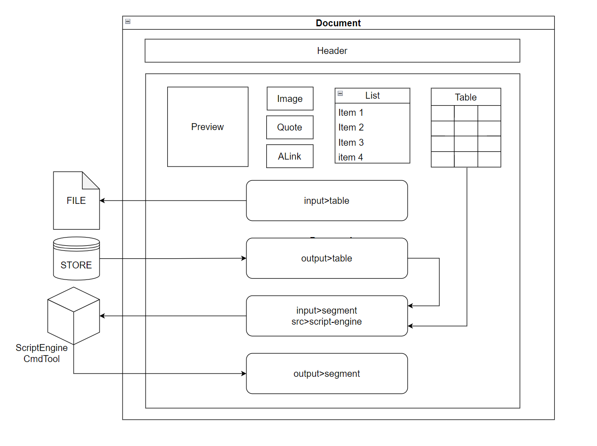

# casetdown

这是一个使用markdown做前端的项目生成工具, 灵感来自于[这里](https://gitlab.ctbiyi.com/Frampt/starseraph/-/tree/main/sword/use-markdown-to-write-it-all)

它可以处理报表, 绑定脚本并执行, 原本是想将它作为caset用例框架的一个替代品.  
它引用了`XMLUtils/XmlUtils`,`TextUtils/text_abstract`和`Tabot/simtab`, 理论上可以扩展无数的工具到上面来.  
由于仍在探索中, 发布它的方式采用松散集成进行, 请参看[imdoc/README.md#BUILDS](../README.md#BUILDS)

手册看[这里](doc/MANUAL.md)

# version

> v0.6.0 更新提示;集成文档渲染, 表格读写, 文档检查.  
> v0.7.0 文件夹自动渲染md文档.  
> v0.7.1 修正了标签嵌套和文本嵌套只显示正文不显示链接的bug.  
> v0.7.2 跳过了windows的bat执行(权限问题多), 跳过了非指定格式的命令执行.   
> v0.8.0 增加了`endata/endata-app`、`tabot/newtab`、`textutils/textmind`的集成, 用于数据集成.
> v0.8.2 扩展了`endata/api-app`, 用于API-Request.
> v0.9.0 增加了erlang脚本执行的支持; 增加了`preview`、`debug`标签.
> 